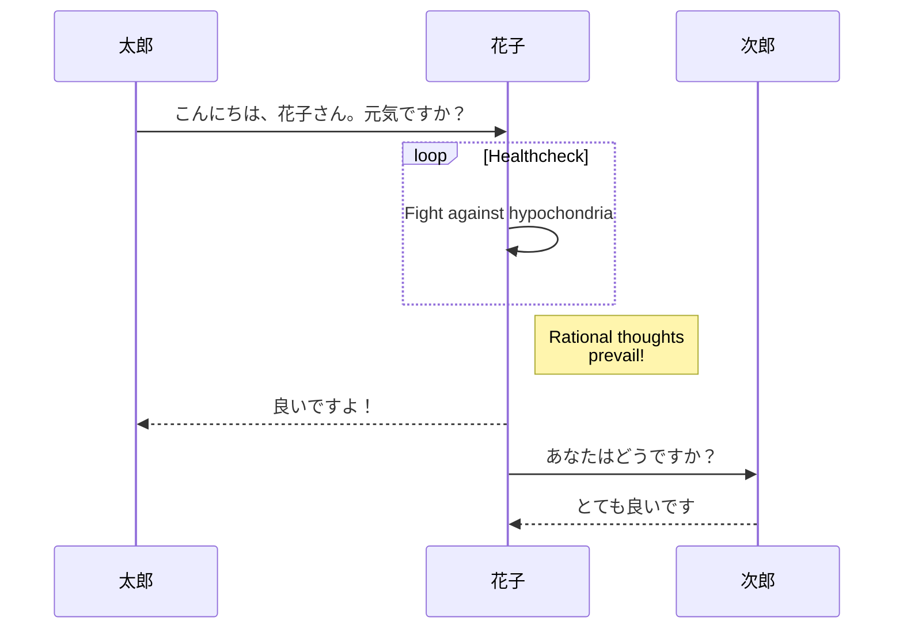
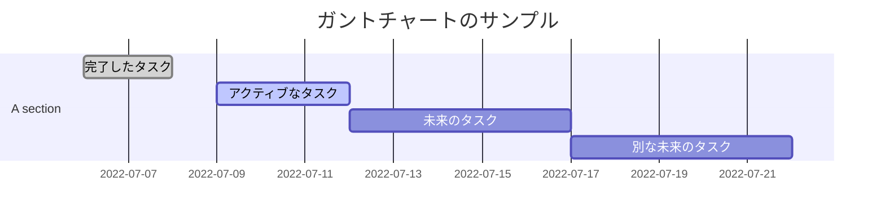
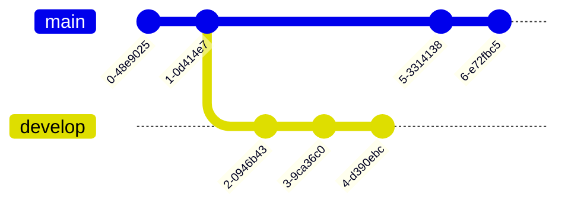
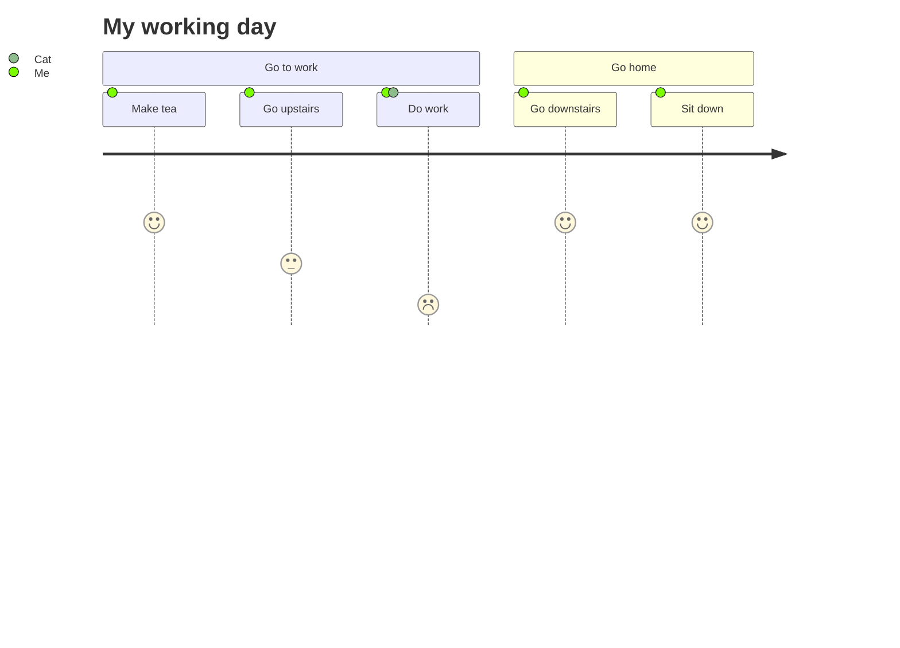
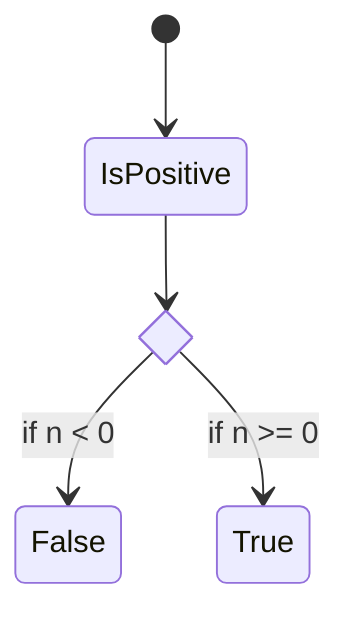
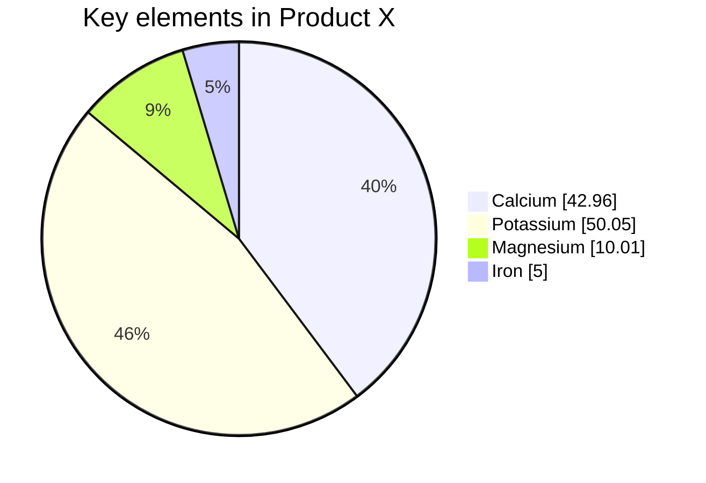

# This is an <h1> tag

## This is an <h2> tag
### This is an <h3> tag
#### This is an <h4> tag

*This text will be italic*

_This will also be italic_

**This text will be bold**

__This will also be bold__

## Lists

### Unordered list

* Item 1
  * subItem 1
    * subsubItem 1
    * subsubItem 2
    * subsubItem 3
      * subsubItem 

  * subItem 2
  * subItem 3

* Item 2
* Item 3

### Ordered list

1. Item 1
   1. subsubItem 
   2. subsubItem 
   3. subsubItem 
      1. subsubItem 
      2. subsubItem 
      3. subsubItem 
         1. subsubItem 
            1. subsubItem 

2. Item 2
3. Item 3

### Task list

- [ ] task list 1
- [ ] task list 2
  - [ ] task list 1
  - [x] task list 2
- [ ] task list 3

### Description list

<dl>
  <dt>リンゴ</dt>
  <dd>赤いフルーツ</dd>
  <dt>オレンジ</dt>
  <dd>橙色のフルーツ</dd>
</dl>

## Images
### Caption


_This is the Image Caption_

### Size

{: width="1000" height="1000" }

### Position
#### Normal position

先帝创业未半而中道崩殂，今天下三分，益州疲弊，此诚危急存亡之秋也。然侍卫之臣不懈于内，忠志之士忘身于外者，盖追先帝之殊遇，欲报之于陛下也。诚宜开张圣听，以光先帝遗德，恢弘志士之气，不宜妄自菲薄，引喻失义，以塞忠谏之路也。

宫中府中，俱为一体，陟罚臧否，不宜异同。若有作奸犯科及为忠善者，宜付有司论其刑赏，以昭陛下平明之理，不宜偏私，使内外异法也。

侍中、侍郎郭攸之、费祎、董允等，此皆良实，志虑忠纯，是以先帝简拔以遗陛下。愚以为宫中之事，事无大小，悉以咨之，然后施行，必能裨补阙漏，有所广益。

{: .normal }

将军向宠，性行淑均，晓畅军事，试用于昔日，先帝称之曰能，是以众议举宠为督。愚以为营中之事，悉以咨之，必能使行阵和睦，优劣得所。

亲贤臣，远小人，此先汉所以兴隆也；亲小人，远贤臣，此后汉所以倾颓也。先帝在时，每与臣论此事，未尝不叹息痛恨于桓、灵也。侍中、尚书、长史、参军，此悉贞良死节之臣，愿陛下亲之信之，则汉室之隆，可计日而待也。

臣本布衣，躬耕于南阳，苟全性命于乱世，不求闻达于诸侯。先帝不以臣卑鄙，猥自枉屈，三顾臣于草庐之中，咨臣以当世之事，由是感激，遂许先帝以驱驰。后值倾覆，受任于败军之际，奉命于危难之间，尔来二十有一年矣。

先帝知臣谨慎，故临崩寄臣以大事也。受命以来，夙夜忧叹，恐托付不效，以伤先帝之明，故五月渡泸，深入不毛。今南方已定，兵甲已足，当奖率三军，北定中原，庶竭驽钝，攘除奸凶，兴复汉室，还于旧都。此臣所以报先帝而忠陛下之职分也。至于斟酌损益，进尽忠言，则攸之、祎、允之任也。

愿陛下托臣以讨贼兴复之效，不效，则治臣之罪，以告先帝之灵。若无兴德之言，则责攸之、祎、允等之慢，以彰其咎；陛下亦宜自谋，以咨诹善道，察纳雅言，深追先帝遗诏，臣不胜受恩感激。

今当远离，临表涕零，不知所言。

#### Float to the left


臣亮言す。先帝業を創めて未だ半ばならずして、中道にして崩祖せり。今天下三分すれども、益州は疲弊す。此れ誠に危急存亡の秋なり。然れども侍衛の臣、内に懈らず、忠志の士、身を外に忘るるは、蓋し先帝の殊遇を追いて、之を陛下に報いんと欲すればなり。誠に宜しく聖聴を開張して、以て先帝の遺徳を光かにし、志士の気を恢弘すべし。宜しく妄りに菲薄なりとし、喩えを引き義を失いて、以て忠諫の路を塞ぐべからざるなり。

　　宮中、府中は倶に一体たり。臧否を陟罰すること、宜しく異同あるべからず。若し姦を作し科を犯し、及び忠善を為す者有らば、宜しく有司に付して、其の刑賞を論じ、以て陛下平明の治を昭らかにすべし。宜しく偏私して内外をして法を異にせしむべからざるなり。

　　侍中、侍郎、郭攸之、費偉、董允らは、此れ皆良実にして、志慮忠純なり。是を以て先帝簡抜して、以て陛下に遺せり。愚以為く、宮中の事は、事大小と無く、悉く以て之に諮り、然る後に施行せば、必ず能く闕漏を裨補し、広く益する所あらん。将軍向寵は、性行淑均にして、軍事に堯暢し、昔日に試用せられ、先帝之を称して、能ありと曰えり。是を以て衆議寵を挙げて以て督と為せり。愚以為く、営中の事は、事大小と無く、悉く以て之に諮らば、必ず能く行陣をして和睦せしめ、優劣所を得しめん。

　　賢臣に親しみ、小人を遠ざくるは、此れ先漢の興隆せし所以なり。小人に親しみ、賢臣を遠ざくるは、此れ後漢の傾頽せし所以なり。先帝在しし時、毎に臣と此の事を論じ、未だ嘗て桓、霊に歎息痛恨せずんばあらざりき。侍中、尚書、長史、参軍は、此れ悉く貞亮にして、節に死するの臣なり。願わくは陛下、之に親しみ、之を信ぜば、則ち漢室の隆んならんこと、日を計えて待つ可し。

{: .left  }

　　臣は本布衣にして、南陽に躬耕し、苟も性命を乱世に全うし、聞達を諸侯に求めざりき。先帝臣の卑鄙なるを以てせず、猥に自ら枉屈し、三たび臣を草盧の中に顧みて、臣に諮るに当世の事を以てせり。是に由りて感激し、遂に先帝に許すに駆馳を以てす。後、傾覆に値い、任を敗軍の際に受け、命を危難の間に奉じ、爾来二十有一年なり。

　　先帝は臣の謹慎なるを知り、故に崩ずるに臨み、臣に寄するに大事を以てせり。命を受けしより以来、夙夜に憂歎し、付託の効あらずして、以て先帝の明を傷つけんことを恐る。故に五月、濾を渡り、深く不毛に入り、今、南方己に定まり、兵甲己に足る。当に三軍を奬率し、北のかた中原を定むべし。庶くは駑鈍を竭くし、姦凶を攘除し、漢室を興復して旧都に還らん。此れ臣の先帝に報いて陛下に忠なるの職分なり。

　　損益を斟酌し、進みて忠言を尽くすに至りては、則ち攸之、偉、允の任なり。願わくは陛下臣に託するに討賊興復の効を以てせよ。効あらずんば則ち臣の罪を治めて、以て先帝の霊に告げよ。若し徳を興すの言無くんば、則ち攸之、偉、允らの咎を責めて、以て其の慢を彰かにせよ。陛下もまた宜しく自ら謀りて、以て善道を諮諏し、雅言を察納し、深く先帝の遺詔を追うべし。臣、恩を受けし感激に勝えず、今、遠く離るるに当り、表に臨みて涕泣し、云う所を知らず。

#### Float to the right


신 제갈량은 아룁니다: 선제께서 창업을 아직 반도 못이루시고, 중도에 돌아가셨습니다.
지금 천하가 셋으로 나뉘어지고 익주가 피폐해졌는데, 이는 진실로 위급하고 존망이 달려있는때입니다.
그런데 모시고 호위하는 신하들이 안에서 게을리하지 않고 충성스럽고 뜻있는 장수들이 제 몸을 잊는 것은 대체로 선제의 특별한 대우를 기리어, 폐하에게 값고자 하는 것입니다.
진실로 마땅히 성스러운 견문을 넓게 열어서 선제의 남기신 덕을 빛내시고 뜻있는 선비들의 기개를 넓히셔야 하며, 망령되이 스스로 변변치 못하다고 여기셔서 잘못된 비유를 끌어들여 (올바름을 잃고) 충간의 길을 막아버리시면 안됩니다.
궁중과 부중이 모두 한몸이 되고 잘한 이를 상주고 잘못한 자를 벌주는데 있어서 차이가 있어서는 안됩니다.
만약 간사한짓을 하거나 규율을 범하는 자나 충성스럽고 착한 사람이 있거든 마땅히 관리에게 맡겨 형벌과 상을 논하게 하여 폐하의 공평하고 밝은 다스림을 분명하게 드러내야 하며, 사사로운 정에 치우쳐 안과 밖의 법을 달리해서는 안됩니다.
시중.시랑인 곽유지.비위.동윤등 이들은 모두 선량하고 성실하며 뜻과 생각이 충성스럽고 순수하니 그런까닭에 선제께서 그들을 선발하여 폐하께 남겨주셨습니다.
제가 생각건데 궁중의 일은 크고 작음을 막론하고 모두 그들에게 자문하시고 그런후에 시행하시면 반드시 모자라고 빠진점을 보충할수 있고 널리 이로움이 있을수 있을것입니다.
장군 상총은 성정과 행실이 훌륭하고 공평하며 군대의 일에 밝게 통달하여 옛날에 그를 시험삼아 써보시고 선제께서 그를 칭한하여 "유능하다"하셨습니다. 그런까닭에 뭇사람들이 의논하여 상총을 도독으로 천거하였습니다.
제가 생각건데 군대의 일은 크고 작음을 막론하고 모두 그에게 자문하시면 반드시 진영이 화목하게 되고 뛰어난자와 열등한자가 제자리를 얻게 할수 있을것입니다.

{: .right  }

어진신하를 가까이 하고 소인을 멀리한것, 이것은 선대의 한이 흥성하고 융성한 까닭입니다.
소인을 가까이 하고 어진신하를 멀리한것, 이것은 후한이 기울어지고 쓰러진 까닭입니다.
선제께서 제위에 계실때 매번 신과 더불어 이일을 논의 하실때마다 환제. 영제의 일을 탄식하고 통한스러워하지 않은적이 일찍이 없었습니다. 시중. 상서. 장사. 참군. 이들은 모두 곧고 밝으며 죽음으로써 절개를 지킬 신하들입니다. 바라건데 폐하께서는 그들을 가까이 하시고 그들을 신뢰하십시오. 그러면 한 왕실의 융성은 날짜를 세면서 기다릴수 있을것입니다.
신은 본래 평민으로 남양에서 몸소 밭갈며 구차하게 난세에 생명을 보전하면서 제후들에게 이름이 알려지는 것을 구하지 않았습니다. 선제께서는 신을 비루하다 여기지 않으시고 외람되이 스스로 몸을 굽혀 방문하시어 초막으로 신을 세번이나 찾아와 당시의 일을 신에게 자문하셨으니 이로 말미암아 감격하여 마침내 선제에게 부지런히 내달리기를 허락하였습니다.
훗날 나라가 기울어지고 뒤집어질듯한 때가 되어 군대가 패전하는 때에 임무를 받고 위태롭고 어려운때에 명을 받들었는데 그런 뒤로 21년이 되었습니다. 선제께서는 신이 삼가고 신중하다는 것을 아시고 돌아가실때에 신에게 큰일을 맡기신것입니다. 명을 받은 이래로 밤낮으로 근심하고 걱정하며 맡기신일이 이루어지지 않아서 선제의 영명함을 손상시키게 되지 않을까 두려워했습니다. 그래서 5월에 노수를 건너 불모의 땅으로 깊이 들어간것입니다.
지금 남방은 이미 평정되었고 군사와 무기는 이미 풍족하니 마땅히 삼군을 독려하여 거느리고 북쪽으로 중원을 평정해야합니다. 바라건대 보잘것 없고 노둔한 재주를 다하여 간사하고 흉악한 무리를 물리치고 한 왕실을 회복하고 흥성시켜 옛도읍으로 돌아가고자 합니다. 이는 신이 선제께 보답하고 폐하께 충성을 다하는 직분입니다.
손익을 미루어 살피고 충성스러운 말을 다 아뢰는 것은 곽유지, 비위, 동윤등의 임무입니다.
바라건대 폐하께서는 신에게 적을 토벌하고 (항 왕실)을 회복하고 흥성시키는 성과를 맡기시어 이루어지지 않으면 신의 죄를 다스려 선제의 영에 고하시고 덕을 일으키는 말이 없거든 곽유지. 비의. 동윤등의 잘못을 책망하여 그 태만함을 드러내십시오.
폐하께서는 또 마땅히 스스로 살피시어 선도를 자문하고 바른말을 살피고 받아들여 선제의 남기신 명을 깊이 따르십시오. 신은 은혜를 받음에 감격하여 지금 멀리 떠날때가 되어 출사표를 대하니 눈물이 흘러 말할바를 모르겠나이다.

#### Shadow

{: .shadow  }

## Prompts

> Example line for prompt. 
{: .prompt-info }

> Example line for prompt. 
{: .prompt-tip }

> Example line for prompt. 
{: .prompt-warning }

> Example line for prompt. 
{: .prompt-danger }

## Syntax

今当远离，临表涕`inline code part`零，不知所言。

`/path/to/a/file.extend`{: .filepath}

```
This is a plaintext code snippet.
```

```yaml
key: value
```
```shell
echo 'No more line numbers!'
```
{: .nolineno }

```shell
# content
```
{: file="path/to/file" }


```liquid

  This product's title contains the word Pack.

```


## Footnote

Click the hook will locate the footnote[^1], and here is another footnote[^2]

## Mermaid SVG















## Mathematics

The mathematics powered by [**MathJax**](https://www.mathjax.org/):

When $a \ne 0$, there are two solutions to $(ax^2 + bx + c = 0)$ and they are 

$$ x = {-b \pm \sqrt{b^2-4ac} \over 2a} $$

## Links

[http://127.0.0.1:4000](http://127.0.0.1:4000/)

## Tables

| Company                      | Contact          | Country |
| :--------------------------- | :--------------- | ------: |
| Alfreds Futterkiste          | Maria Anders     | Germany |
| Island Trading               | Helen Bennett    |      UK |
| Magazzini Alimentari Riuniti | Giovanni Rovelli |   Italy |

## Reverse Footnote


[^1]: The footnote source 

[^2]: The footnote source 2
